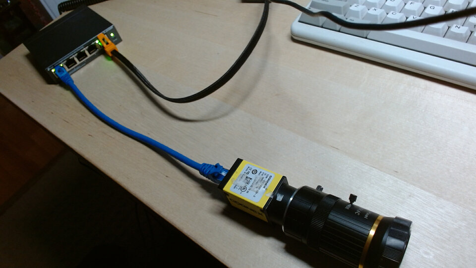
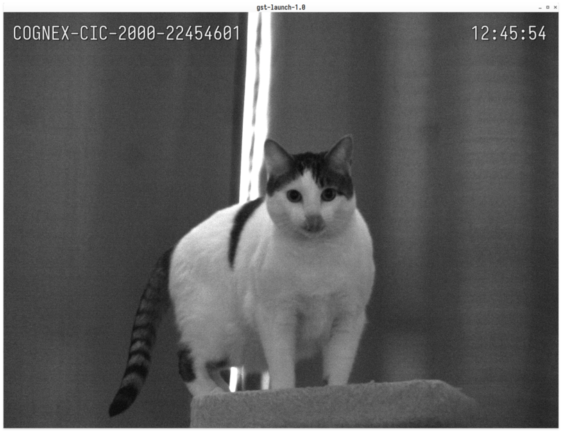
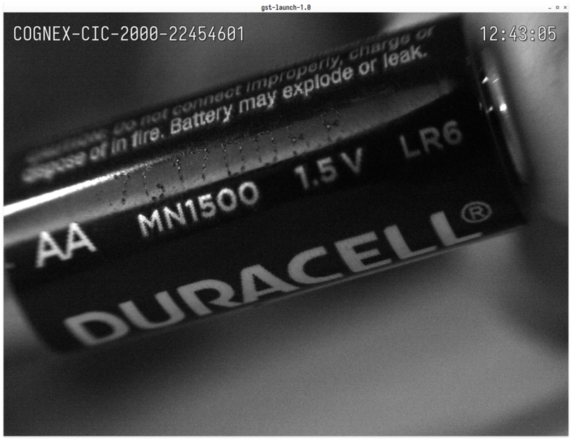

# Aravis and GStreamer on Fedora

This is a short and simple guide to getting started with the
[Aravis](https://github.com/AravisProject/aravis) gstreamer plugin on Fedora Linux.
I'm going to be using a
[COGNEX CAM-CIC-2000-60-G](https://www.powermotionstore.com/products/CAM-CIC-2000-60-G)
camera along with a cheap TP-Link 4 port PoE switch to power it and connect it to my PC.


## Installation
Aravis is not currently packaged for any linux distro so we're have
to get a source tarball and install the dependencies ourselves. I've written
a [shell script](https://git.sr.ht/~danofsteel32/aravis-fedora) to automate this
and included it below:

```bash
#!/bin/bash

# This script will fetch, build and install the latest release of
# https://github.com/AravisProject/aravis on Fedora Linux

set -o errexit
set -o nounset
set -o pipefail

SCRIPTPATH="$( cd -- "$(dirname "$0")" >/dev/null 2>&1 ; pwd -P )"
SRC_DIR="${SCRIPTPATH}/aravis-src"

wrapped-curl() {
    curl --silent --show-error --retry 3 "$@"
}

get-src() {
    # Download the latest release and extract into $SRC_DIR
    local latest_url="https://api.github.com/repos/AravisProject/aravis/releases/latest"
    local tarball_url=""
    tarball_url=$(wrapped-curl -s "${latest_url}" | jq .tarball_url | tr -d '"')
    if [[ -z "${tarball_url}" ]]; then
        echo "Could not get tarball_url from api.github.com"
        return 1
    fi

    local tarball="aravis.tar.gz"
    if wget "${tarball_url}" --quiet --tries=3 -O "${tarball}"; then
        mkdir -p "${SRC_DIR}"
        tar --extract --file "${tarball}" -C "${SRC_DIR}" --strip-components=1
    else
        echo "Failed to download src tarball from ${tarball_url}"
        return 1
    fi
}

install-deps() {
    # Kitchen sink approach but all build-time options will be auto-detected
    # and enabled and you'll be able to use the python bindings
    set -x
    sudo dnf update && sudo dnf install gstreamer1 \
        gstreamer1-devel \
        gstreamer1-doc \
        gstreamer1-libav \
        gstreamer1-vaapi \
        gstreamer1-plugins-base-tools \
        gstreamer1-plugins-base-devel \
        gstreamer1-plugins-good \
        gstreamer1-plugins-good-extras \
        gstreamer1-plugins-ugly \
        gstreamer1-plugins-bad-free \
        gstreamer1-plugins-bad-free-devel \
        gstreamer1-plugins-bad-free-extras \
        gobject-introspection \
        gobject-introspection-devel \
        python3-gobject \
        gi-docgen \
        ninja-build \
        meson \
        g++ \
        cmake \
        glib2-devel \
        gtk3-devel \
        gtk-doc \
        libxslt  \
        libxml2-devel \
        libusb1-devel
    set +x
}

build() {
    cd "${SRC_DIR}"
    meson build
    cd build
    ninja
    set -x
    sudo ninja install
    set +x
}

clean() {
    local build_dir="${SRC_DIR}/build"
    if [[ -d "${build_dir}" ]]; then
        cd "${build_dir}"
        # be quiet about it
        set -x
        sudo ninja uninstall > /dev/null 2>&1
        set +x
    fi

    # make sure local $src_dir will be in . (current dir)
    cd "${SCRIPTPATH}"
    if [[ -d "${SRC_DIR}" ]]; then
        local src_dir=""
        src_dir=$(basename "${SRC_DIR}")
        rm -rf "${src_dir}"
    fi

    if [[ -f "aravis.tar.gz" ]]; then
        rm aravis.tar.gz
    fi
}

default() {
    if get-src && install-deps && build; then
        local green="\033[0;32m"
        local no_color="\033[0m"
        echo
        echo -e "${green}Successfully built and installed aravis${no_color}"
        echo
        echo "To use the gstreamer plugin you'll have to set the ENV vars:"
        echo "export GI_TYPELIB_PATH=/usr/local/lib64/girepository-1.0"
        echo "export GST_PLUGIN_PATH=/usr/local/lib64/gstreamer-1.0"
        echo
    fi
}

"${@:-default}"
```

Save the file as `run.sh` and run it with `./run.sh`. If you want to remove
Aravis do `./run.sh clean`. Make sure to export the `GI_TYPELIB_PATH` and
`GST_PLUGIN_PATH` vars and test that the GStreamer plugin was successfully
installed with `gst-inspect-1.0 aravissrc`.

## Networking

Now we need to do some networking configuration before can use our camera.
Connect your camera to one of the switches PoE ports and then connect your
the switch to your computer using another one of the switches ports. In my case
this looks like:



Next list your network connections:
<pre><code class=language-shell>
$ nmcli conn show

NAME                UUID                                  TYPE      DEVICE    
Wired Connection 1  9e4786e0-b2ab-3b1f-aa31-5285d2c2412d  ethernet  eno1      
13_going_on_30      e4955e17-9cb3-41e0-9df5-06c057803c58  wifi      wlp0s20f3
</code></pre>

My computer is connected to my wifi network `13_going_on_30` and the switch 
connected at `Wired Connection 1`. Your setup will probably be different from
mine so double check that you apply the following steps to the right connection.

Rename the connection to make life a little easier:
<pre><code class=language-shell>
$ nmcli conn modify "Wired connection 1" con-name cam-net
$ nmcli conn show

NAME            UUID                                  TYPE      DEVICE    
cam-net         9e4786e0-b2ab-3b1f-aa31-5285d2c2412d  ethernet  eno1      
13_going_on_30  e4955e17-9cb3-41e0-9df5-06c057803c58  wifi      wlp0s20f3
</code></pre>

GigE cameras use a [Link-local Address (LLA)](https://en.wikipedia.org/wiki/Link-local_address)
by default so we need to set the IP on our `cam-net` to also be on the Link-local network:
<pre><code class=language-shell>
$ nmcli conn modify cam-net ipv4.address 169.254.0.0/16
$ nmcli conn modify cam-net ipv4.method manual
</code></pre>

We can also enable jumbo frames/packets on `cam-net` to improve performance:
<pre><code class=language-shell>
$ nmcli conn modify cam-net 802-3-ethernet.mtu 9000
</code></pre>

The cam-net connection may have timed out waiting to be assigned an IP address
from a dhcp server so you may need to bring it back up:
<pre><code class=language-shell>
$ nmcli conn show --active

NAME            UUID                                  TYPE      DEVICE    
13_going_on_30  e4955e17-9cb3-41e0-9df5-06c057803c58  wifi      wlp0s20f3 

$ nmcli conn up cam-net
$ nmcli conn show --active

NAME            UUID                                  TYPE      DEVICE    
13_going_on_30  e4955e17-9cb3-41e0-9df5-06c057803c58  wifi      wlp0s20f3 
cam-net         9e4786e0-b2ab-3b1f-aa31-5285d2c2412d  ethernet  eno1
</code></pre>


## Use Aravis

We can use the `arv-tool-0.8` command to check that our camera is being detected:
<pre><code class=language-shell>
$ arv-tool-0.8

COGNEX-CIC-2000-22454601 (169.254.74.116)
</code></pre>

If your camera is detected we can now use the GStreamer plugin. Here's
an example `gst-launch-1.0` script:

```bash
#!/usr/bin/env bash

framerate=30
exposure=33333  # (1 / framerate) * 100,000
cam_name="${1:-}"  # Optional camera-name arg
if [[ -z "${cam_name}" ]]; then
    echo "Default to using first detected camera"
    cam_name=$(arv-tool-0.8 | awk 'NR==1{print $1}' | tr -d "\n")
fi

gst-launch-1.0 aravissrc camera-name=${cam_name} exposure="${exposure}" gain-auto=2 packet-size=9000 \
    ! video/x-raw,framerate=${framerate}/1 \
    ! clockoverlay valignment=top halignment=right \
    ! textoverlay text="${cam_name}" valignment=top halignment=left \
    ! videoconvert \
    ! queue \
    ! autovideosink
```

A couple of screenshots from the above pipeline:




